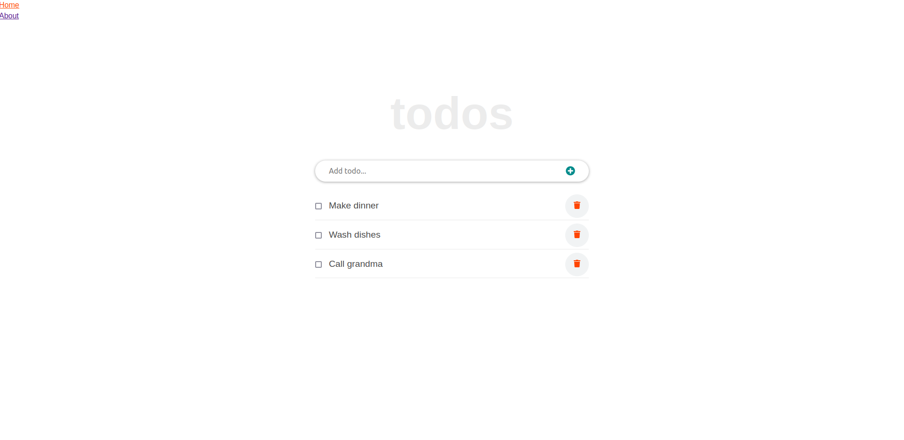

# Todo-app
* This project was created using React, it renders functional components and lift ups the state from the grand child component to the main component, also it routes between paths so it can be displayed as a single page application. The Todo items can be added, marked, deleted and edited.



## Built With

- Html, Javascript, CSS
- Webpack
- React JS
- Developed in VSCode

## Setup 
### clone repository
```bash
$ git clone <git@github.com:JbirdL86/react-todo-app.git>
```
### Start Project
```bash
$ cd react-todo-app 
-Install node_modules
-run yarn
$ yarn start
```

### Author 🤝:
* Juan Luis Gonzalez 
- Github: [@githubhandle](https://github.com/JbirdL86)
- Twitter: [@twitterhandle](https://twitter.com/JuanLui06498455)
- Linkedin: [linkedin](https://www.linkedin.com/in/juan-luis-0551921aa/)

## 🤝 Contributing

Contributions, issues, and feature requests are welcome!

Feel free to check the issues page. [issues page](https://github.com/JbirdL86/react-todo-app/issues).

## Show your support

Give a ⭐️ if you like this project!

## 📝 License

This project is [MIT](./MIT.md) licensed.